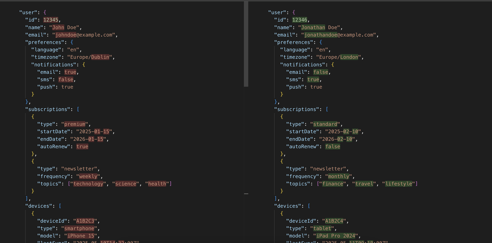

# Inline Diffing Tool

A modern web application for comparing and visualizing differences between text or code snippets inline. This tool helps developers and content creators easily identify changes between different versions of text or code.

## Features

- Inline diff visualization
- Real-time comparison
- Clean and intuitive user interface
- Support for code and plain text
- Easy-to-use interface

## Screenshots



## Getting Started

### Prerequisites

- Node.js (v14 or higher)
- npm or yarn

### Installation

1. Clone the repository:
```bash
git clone [repository-url]
```

2. Install dependencies:
```bash
npm install
# or
yarn install
```

3. Start the development server:
```bash
npm start
# or
yarn start
```

The application will be available at `http://localhost:3000`

## Usage

1. Enter or paste your original text in the first input area
2. Enter or paste the modified text in the second input area
3. The differences will be automatically highlighted inline
4. Changes are displayed in real-time as you type

## Technologies Used

- React
- Modern JavaScript (ES6+)
- CSS3

## Contributing

Contributions are welcome! Please feel free to submit a Pull Request.

## License

This project is licensed under the MIT License - see the LICENSE file for details. 